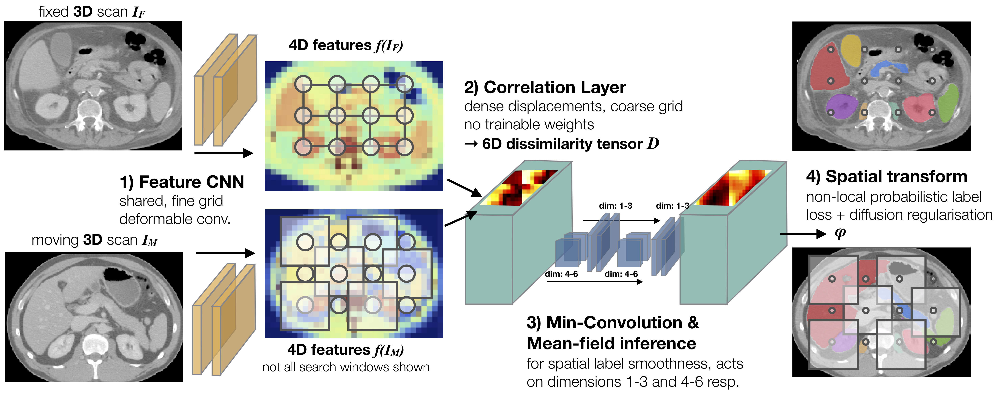

# pdd_net
Probabilistic Dense Displacement Network (3D discrete deep learning registration) 

Code for the MICCAI 2019 paper: "Closing the Gap between Deep and Conventional Image Registration using Probabilistic Dense Displacement Networks"

We address the shortcoming of current DL-registration approaches that lack the ability to learn large complex deformation with few labelled training scans by leveraging ideas from probabilistic dense displacement optimisation. These approaches have excelled in many registration tasks with large deformations. We propose to design a network with approximate min-convolutions and mean field inference for differentiable displacement regularisation within a discrete weakly-supervised registration setting. By employing these meaningful and theoretically proven constraints, our learnable registration algorithm contains very few trainable weights (primarily for feature extraction) and is easier to train with few labelled scans. It is very fast in training and inference and achieves state-of-the-art accuracies for the challenging inter-patient registration of abdominal CT outperforming previous deep learning approaches by 15% Dice overlap.

Concept of probabilistic dense displacement network: 1) deformable convolution layers extract features for both fixed and moving image. 2) the correlation layer evaluates for each 3D grid point a dense displacement space yielding a 6D dissimilarity map. 3) spatial filters that promote smoothness act on dimensions 4-6 (min-convolutions) and dim. 1-3 (mean-field inference) in alternation. 4) the probabilistic transform distribution obtained using a softmax (over dim. 4-6) is used in a non-local label loss and converted to 3D displacements for a diffusion regularisation and to warp images.

More details will follow, please see basic example in provided pytorch code (v0.1)
A more modular version and scripts to pre-process your own data is currently in progress.

If you find this method useful and want to use (parts of) it. Please cite the following publication:
M.P. Heinrich: "Closing the Gap between Deep and Conventional Image Registration using Probabilistic Dense Displacement Networks" MICCAI 2019 Springer LNCS (accepted, in press)
